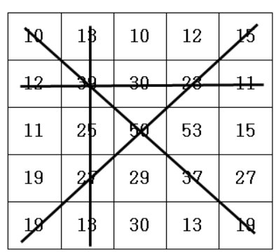

# 격자판 최대합

### 설명
5*5 격자판에 아래롸 같이 숫자가 적혀있습니다.

N*N의 격자판이 주어지면 각 행의 합, 각 열의 합, 두 대각선의 합 중 가 장 큰 합을 출력합니다.

### 입력
첫 줄에 자연수 N이 주어진다.(2<=N<=50)

두 번째 줄부터 N줄에 걸쳐 각 줄에 N개의 자연수가 주어진다. 각 자연수는 100을 넘지 않는다.
<p>5<br>
10 13 10 12 15<br>
12 39 30 23 11<br>
11 25 50 53 15<br>
19 27 29 37 27<br>
19 13 30 13 19<br>
</p>

### 출력
최대합을 출력합니다.
<p>155</p>

### 풀이
```java
import java.io.BufferedReader;
import java.io.IOException;
import java.io.InputStreamReader;
import java.util.StringTokenizer;

class Main {
    public int solution(int n, int[][] arr) {
        // 각 행의 합 -> [0][x]
        // 각 열의 합 -> [x][0]
        int max = 0;

        for(int i = 0; i < n; i++) {
            int col = 0;
            int row = 0;
            for(int j = 0; j<n; j++) {
                col += arr[i][j];
                row += arr[j][i];
            }
            if(Math.max(col, row) > max) {
                max = Math.max(col, row);
            }
        }
        // 대각선 ->[x][x]
        int sum = 0;
        // 역대각선합
        int slash = 0;

        int i = 0;
        int j = arr.length-1;

        for(int k = 0; k < n; k++) {
            sum += arr[k][k];
            slash+= arr[i][j];
            i++;
            j--;
        }

        return Math.max(max, (Math.max(sum, slash)));
    }


    public static void main(String[] args) throws IOException {
        Main T = new Main();

        BufferedReader br = new BufferedReader(new InputStreamReader(System.in));
        int n = Integer.parseInt(br.readLine());

        int[][] arr = new int[n][n];

        for(int i = 0; i < n; i++) {
            StringTokenizer st = new StringTokenizer(br.readLine());
            for(int j = 0; j < n; j++) {
                arr[i][j] = Integer.parseInt(st.nextToken());
            }
        }

        int answer = T.solution(n, arr);

        System.out.println(answer);

    }
}
```