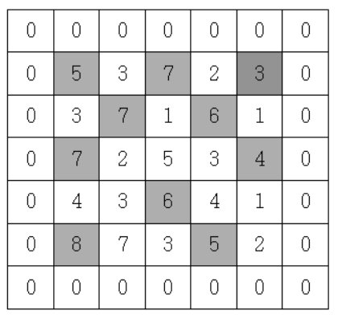

# 봉우리

### 설명
지도 정보가 N*N 격자판에 주어집니다. 각 격자에는 그 지역의 높이가 쓰여있습니다.
각 격자판의 숫자 중 자신의 상하좌우 숫자보다 큰 숫자는 봉우리 지역입니다. 봉우리 지역이 몇 개 있는 지 알아내는 프로그램을 작성하세요.
격자의 가장자리는 0으로 초기화 되었다고 가정한다.
만약 N=5 이고, 격자판의 숫자가 다음과 같다면 봉우리의 개수는 10개입니다.


### 입력
첫 줄에 자연수 N이 주어진다.(2<=N<=50)
두 번째 줄부터 N줄에 걸쳐 각 줄에 N개의 자연수가 주어진다. 각 자연수는 100을 넘지 않는다.

<p>5<br>
5 3 7 2 3<br>
3 7 1 6 1<br>
7 2 5 3 4<br>
4 3 6 4 1<br>
8 7 3 5 2<br>
</p>

### 출력
봉우리의 개수를 출력하세요.
<p>10</p>

### 풀이
```java
import java.io.BufferedReader;
import java.io.IOException;
import java.io.InputStreamReader;
import java.util.StringTokenizer;

class Main {
    public int solution(int n, int[][] arr) {
        int count = 0;

        for(int i = 1; i < arr.length-1; i++) {
            for(int j = 1; j < arr[i].length-1; j++) {
                int max = arr[i][j];
                if(max > arr[i][j-1] && max > arr[i][j+1]&& max > arr[i-1][j] && max > arr[i+1][j]) {
                    count++;
                }
            }
        }
        return count;
    }


    public static void main(String[] args) throws IOException {
        Main T = new Main();

        BufferedReader br = new BufferedReader(new InputStreamReader(System.in));
        int n = Integer.parseInt(br.readLine());

        int[][] arr = new int[n+2][n+2];

        for(int i = 1; i <= n; i++) {
            StringTokenizer st = new StringTokenizer(br.readLine());
            for(int j = 1; j <= n; j++) {
                arr[i][j] = Integer.parseInt(st.nextToken());
            }
        }

        int answer = T.solution(n, arr);

        System.out.println(answer);

    }
}
```